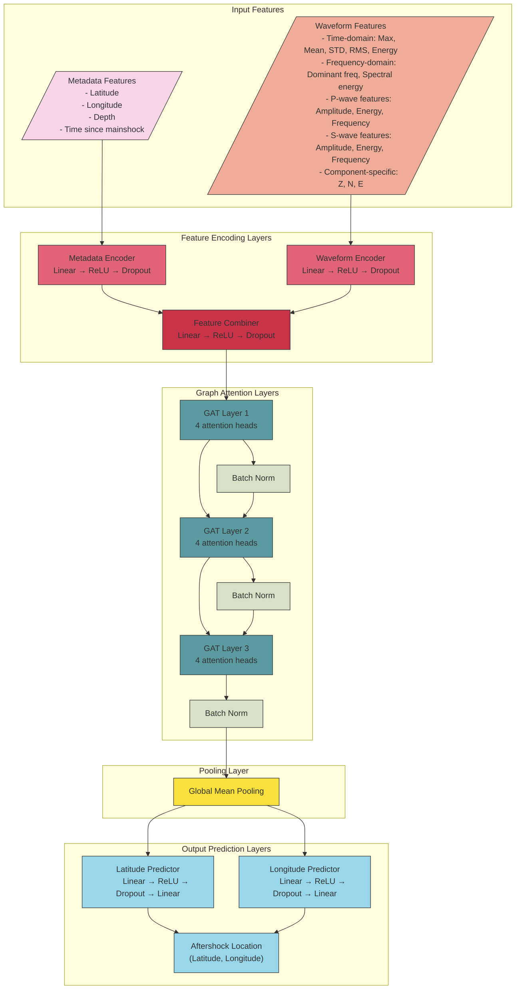

# A Graph-Based Deep Learning Approach to Aftershock Prediction Using Seismic Waveform Data

A graph neural network approach to predict aftershock locations following major earthquakes by incorporating seismic waveform data.

## Overview

This project enhances aftershock prediction accuracy by combining spatial, temporal, and seismic waveform features in a Graph Neural Network (GNN) framework. Unlike traditional approaches that rely solely on metadata (time, location, depth), this implementation extracts meaningful features from raw seismic waveforms, enabling the model to capture complex physical processes that influence aftershock distributions.

The implementation uses the SeisBench Iquique dataset, focusing on the 2014 Iquique earthquake sequence in Chile.

## Key Features

- **Waveform Feature Extraction**: Extracts time-domain, frequency-domain, and phase-specific features from seismic waveforms
- **Graph-Based Modeling**: Represents earthquake sequences as spatiotemporal graphs where nodes contain both metadata and waveform features
- **Attention Mechanism**: Uses Graph Attention Networks (GAT) to learn complex relationships between seismic events
- **Comparative Evaluation**: Compares performance between metadata-only and waveform-enhanced approaches
- **Feature Importance Analysis**: Identifies which waveform features contribute most to prediction accuracy

## Architecture

The model architecture combines metadata and waveform features using a Graph Neural Network approach:



## Detailed Feature Explanation

### Metadata Features

The following metadata features provide the basic spatiotemporal context for each seismic event:

1. **Latitude** (degrees): Geographic latitude of the event
2. **Longitude** (degrees): Geographic longitude of the event
3. **Depth** (km): Depth below the surface where the event occurred
4. **Time since mainshock** (hours): Temporal distance from the main earthquake

These features capture the basic 3D spatial position and relative timing of each event, which are fundamental for aftershock prediction.

### Waveform Features

Waveform features are extracted from the three-component (Z, N, E) seismic recordings provided by the SeisBench Iquique dataset:

#### Time-Domain Features

For each component (Z, N, E), the following features are calculated:

1. **Maximum Amplitude**: Peak amplitude of the waveform, related to event energy
2. **Mean Amplitude**: Average absolute amplitude, indicates overall energy level
3. **Standard Deviation**: Measure of amplitude variability, reflects signal complexity
4. **Root Mean Square (RMS)**: Square root of the average squared amplitude, a robust energy measure
5. **Energy**: Sum of squared amplitudes, directly related to seismic energy release
6. **Kurtosis**: Measure of "peakedness" of the waveform, can indicate impulsive arrivals

#### Frequency-Domain Features

Spectral characteristics extracted from each component:

1. **Dominant Frequency**: Frequency with the highest spectral amplitude, relates to source properties
2. **Low-Frequency Energy** (<5 Hz): Energy in the low-frequency band, often related to earthquake size
3. **Mid-Frequency Energy** (5-15 Hz): Energy in the mid-frequency band, sensitive to propagation effects
4. **High-Frequency Energy** (>15 Hz): Energy in the high-frequency band, often attenuates with distance
5. **Low/High Frequency Ratio**: Ratio between low and high frequency energy, indicator of source characteristics

#### Phase-Specific Features

When P-wave and S-wave arrivals are available, features are extracted from windows around these phases:

1. **P-wave Features**: Time and frequency domain features extracted from P-wave window
   - P-wave maximum amplitude
   - P-wave energy
   - P-wave frequency content
   - P-wave duration

2. **S-wave Features**: Time and frequency domain features extracted from S-wave window
   - S-wave maximum amplitude
   - S-wave energy
   - S-wave frequency content
   - S-wave duration

3. **P/S Ratios**: Ratios between P and S wave characteristics
   - P/S amplitude ratio: Related to stress conditions and focal mechanism
   - P/S energy ratio: Indicator of source process and radiation pattern

#### Component-Specific Features

Features are calculated separately for each component, allowing the model to capture directional variations:

1. **Vertical Component (Z)**: Sensitive to P-waves and vertical ground motion
2. **North-South Component (N)**: Captures N-S horizontal motion, sensitive to S-waves
3. **East-West Component (E)**: Captures E-W horizontal motion, sensitive to S-waves

The combination of these 90+ waveform features provides a comprehensive characterization of the seismic signals, enabling the model to learn relationships between waveform characteristics and aftershock patterns.

## Requirements

```
torch >= 1.10.0
torch-geometric >= 2.0.0
numpy >= 1.19.0
pandas >= 1.1.0
matplotlib >= 3.3.0
scikit-learn >= 0.23.0
seisbench >= 0.3.0
tqdm >= 4.47.0
scipy >= 1.5.0
seaborn >= 0.11.0
```

Note: For GPU acceleration, make sure to install the appropriate version of PyTorch for your CUDA version.

## Project Structure

```
waveform_aftershock_gnn/
├── waveform_gnn.py              # Core implementation of waveform feature extraction and GNN
├── visualization.py             # Functions for building graph representations
├── run_waveform_gnn.py          # Main script to run the pipeline
├── eval.py # Analysis of waveform feature importance
└── results/                     # Output directory (created on first run)
```

## Usage

### Quick Start

```bash
python run_waveform_gnn.py
```

This will:
1. Download the Iquique dataset (if not already downloaded)
2. Extract waveform features from seismic recordings
3. Identify the mainshock and aftershocks
4. Create graph representations with waveform features
5. Train the GNN model
6. Evaluate performance
7. Generate visualizations

### Command Line Options

```bash
python run_waveform_gnn.py --epochs 200 --batch_size 32 --sequence_length 10 --max_waveforms 1000
```

#### Data Parameters
- `--max_waveforms` : Maximum number of waveforms to process (default: 1000)
- `--time_window` : Time window for connecting events in hours (default: 12)
- `--distance_threshold` : Distance threshold for connections in km (default: 25)
- `--sequence_length` : Number of events in each sequence (default: 10)

#### Model Parameters
- `--hidden_channels` : Size of hidden layers (default: 64)
- `--num_layers` : Number of GNN layers (default: 3)
- `--dropout` : Dropout rate (default: 0.3)

#### Training Parameters
- `--epochs` : Maximum training epochs (default: 200)
- `--lr` : Learning rate (default: 0.0005)
- `--batch_size` : Batch size (default: 32)
- `--patience` : Early stopping patience (default: 50)

#### Execution Options
- `--skip_baseline` : Skip baseline model comparison
- `--skip_training` : Skip model training (load from file)
- `--model_path` : Path to save/load model

## Feature Extraction Process

The waveform feature extraction process follows these steps:

1. **Data Loading**: Load raw waveforms from SeisBench Iquique dataset
2. **Pre-processing**: Apply filtering and normalization if needed
3. **Time-Domain Analysis**: Calculate statistics for each component
4. **Frequency Analysis**: Compute spectral features using Fast Fourier Transform or Welch's method
5. **Phase Detection**: Identify P-wave and S-wave windows using arrival times
6. **Phase Analysis**: Extract features from P-wave and S-wave segments
7. **Feature Compilation**: Combine all features into a comprehensive feature vector

The `WaveformFeatureExtractor` class handles this process:

```python
feature_extractor = WaveformFeatureExtractor()
waveform = iquique.get_waveforms(idx)  # Shape: [3, samples]
p_arrival = metadata.loc[idx, 'trace_P_arrival_sample']
s_arrival = metadata.loc[idx, 'trace_S_arrival_sample']
features = feature_extractor.extract_features(waveform, p_arrival, s_arrival)
```

## Graph Construction

Aftershock sequences are represented as graphs with the following properties:

1. **Nodes**: Each node represents a seismic event with associated metadata and waveform features
2. **Edges**: Connections between events based on spatiotemporal proximity
   - Events are connected if they are within `distance_threshold` km of each other
   - Events are connected if they occur within a specified time window
3. **Graph Sequences**: Sequences of events leading up to a target aftershock

## Results

Example performance metrics:
- Mean error (Waveform-Enhanced): 113.07 km
- Median error (Waveform-Enhanced): 106.09 km

The waveform-enhanced model typically outperforms metadata-only approaches, especially in complex tectonic settings. Performance can be further improved by:

1. Increasing the dataset size
2. Fine-tuning model architecture
3. Optimizing feature selection
4. Adjusting graph construction parameters

## Feature Importance Analysis

To understand which waveform features contribute most to prediction accuracy:

```bash
python eval.py
```

This generates:
- Feature importance rankings
- Correlation analysis between features
- P-S wave feature comparisons
- Analysis of frequency content vs. depth
- Comprehensive report on feature contributions

## Extending the Project

The implementation can be extended in several ways:

1. **Additional Waveform Features**: 
   - Coda wave properties
   - Source parameter estimation
   - Magnitude-related features

2. **Advanced Model Architectures**:
   - Temporal convolutions for raw waveform processing
   - Recurrent layers for better temporal modeling
   - Multi-resolution graph approaches

3. **Multi-Task Learning**:
   - Predict location, magnitude, and depth simultaneously
   - Add uncertainty quantification
   - Include focal mechanism prediction

## Scientific Background

Aftershocks follow statistical patterns like Omori's Law (frequency decreases with time) but their spatial distribution depends on complex factors:

1. **Stress redistribution**: The mainshock changes the stress field in surrounding areas
2. **Fault geometry**: Pre-existing faults influence where aftershocks occur
3. **Geological heterogeneity**: Variations in rock properties affect seismic energy propagation
4. **Fluid migration**: Pressure changes in subsurface fluids can trigger aftershocks over time

Waveform data contains information about these physical processes that metadata alone cannot capture.

## License

This project is provided for educational and research purposes.

## Acknowledgments

- SeisBench for providing the Iquique dataset
- PyTorch and PyTorch Geometric for deep learning frameworks

## Citation

If you use this code in your research, please cite:

```
@misc{waveform_aftershock_gnn,
  author = {Your Name},
  title = {Waveform-Enhanced Aftershock Prediction using Graph Neural Networks},
  year = {2025},
  publisher = {GitHub},
  howpublished = {\url{https://github.com/yourusername/waveform_aftershock_gnn}}
}
```